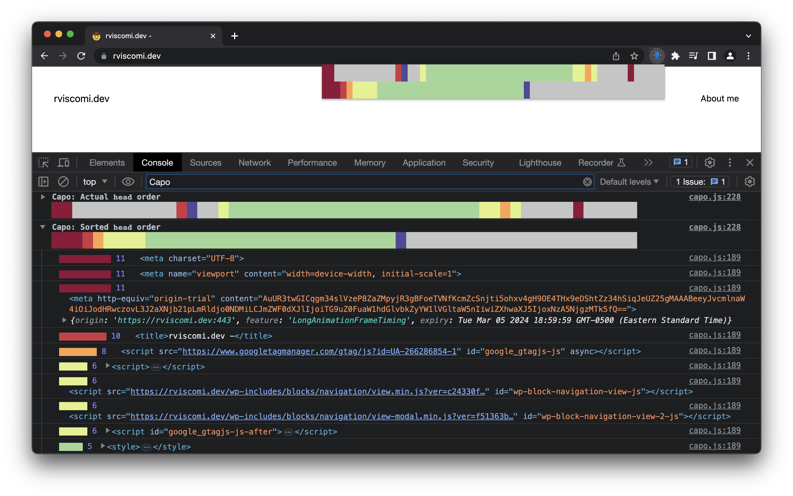

import { Card, CardGrid } from '@astrojs/starlight/components';

:::tip[Inspiration]
This tool was directly inspired by [Harry Roberts](https://twitter.com/csswizardry)' work on [ct.css](https://csswizardry.com/ct/) and [Vitaly Friedman](https://twitter.com/vitalyf)'s [2022 presentation](https://youtu.be/uqLl-Yew2o8?t=2873) at Nordic.js.
:::

## Why it matters

How you order elements in the `<head>` can have an effect on the (perceived) performance of the page.

Capo helps you identify which elements are out of order.

## How to use it

1. Install the [Capo Chrome extension](https://chrome.google.com/webstore/detail/capo-get-your-%3Chead%3E-in-o/ohabpnaccigjhkkebjofhpmebofgpbeb)

OR:

1. Copy [capo.js](https://raw.githubusercontent.com/rviscomi/capo.js/main/snippet/capo.js)
2. Run it in a new [DevTools snippet](https://developer.chrome.com/docs/devtools/javascript/snippets/), or use a [bookmarklet](https://caiorss.github.io/bookmarklet-maker/) generator
3. Explore the console logs

For applications that add lots of dynamic content to the `<head>` on the client, it'd be more accurate to look at the server-rendered `<head>` instead.

### Chrome extension

WIP see the [extension](/capo.js/user/extension/) guide.

### WebPageTest

You can use the [`capo` WebPageTest custom metric](/capo.js/user/webpagetest/) to evaluate only the server-rendered HTML `<head>`. Note that because this approach doesn't output to the console, we lose the visualization.

### BigQuery

You can also use the [`httparchive.fn.CAPO`](/capo.js/user/bigquery/) function on BigQuery to process HTML response bodies in the HTTP Archive dataset. Similar to the WebPageTest approach, the output is very basic.

### Other

Alternatively, you can use local overrides in DevTools to manually inject the capo.js script into the document so that it runs before anything else, eg the first child of `<body>`. Harry Roberts also has a nifty [video](https://www.youtube.com/watch?v=UOn0b5kn3jk) showing how to use this feature. This has some drawbacks as well, for example the inline script might be blocked by CSP.

Another idea would be to use something like Cloudflare workers to inject the script into the HTML stream. To work around CSP issues, you can write the worker in such a way that it parses out the correct `nonce` and adds it to the inline script. _(Note: Not tested, but please share examples if you get it working! _😄_)_

## Summary view

The script logs two info groups to the console: the actual order of the `<head>`, and the optimal order. In this collapsed view, you can see at a glance whether there are any high impact elements out of order.

Each "weight" has a corresponding color, with red being the highest and blue/grey being the lowest. See [rules.js](https://github.com/rviscomi/capo.js/blob/main/src/lib/rules.js) for the exact mapping.

Here are a few examples.

### `www.nytimes.com`

### `docs.github.io`

### `web.dev`

### `stackoverflow.com`

## Detailed view

Expanding the actual or sorted views reveals the detailed view. This includes an itemized list of each `<head>` element and its weight as well as a reference to the actual or sorted `<head>` element.

### `www.nytimes.com`

Here you can see a drilled-down view of the end of the `<head>` for the NYT site, where high impact origin trial meta elements are set too late.

## Next steps

<CardGrid stagger>
  <Card title="Try it" icon="open-book">
    Read the [quick start guide](/capo.js/user/quick-start/).
  </Card>
  <Card title="Get the extension" icon="external">
    Go to [rviscomi.dev/capo-crx](https://rviscomi.dev/capo-crx) to install the extension.
  </Card>
  <Card title="Start contributing" icon="setting">
    [Contribute](/capo.js/developer/contributing/) to the Capo project.
  </Card>
  <Card title="Submit an issue" icon="error">
    Something not working? [File an issue on GitHub.](https://github.com/rviscomi/capo.js/issues/new)
  </Card>
</CardGrid>
