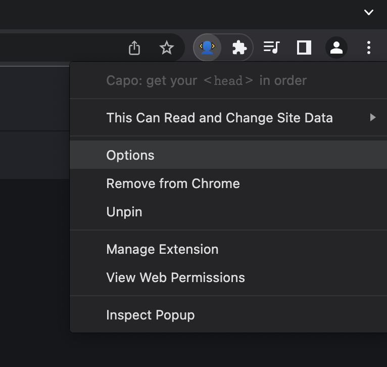
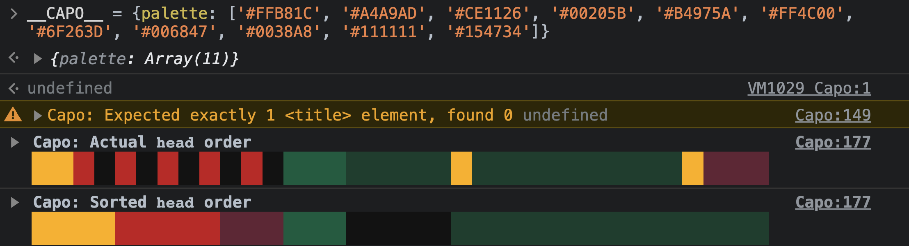

import { Image } from 'astro:assets';
import { Tabs, TabItem } from '@astrojs/starlight/components';
import CapoPalette from '../../../components/CapoPalette.astro';
import CrxOptionsLight from '../../../assets/crx-options-light.png';
import CrxOptionsDark from '../../../assets/crx-options-dark.png';

You can configure how capo.js behaves in a couple of different ways depending on which tool you're using.

## Configuration options

By default, capo.js will:
  - Prefer to evaluate the static, server-rendered head
  - Validate the elements in the `<head>`
  - Print using the default color palette
  - Use the `Capo:` logging prefix

### Static and dynamic evaluation

By default, capo.js will try to evaluate a page's static `<head>`. This is important for validation, because browsers will automatically close the `<head>` when they encounter an invalid element. Without it, capo.js doesn't know which elements were originally marked up to be in the `<head>`.

Static evaluation is also useful if you want to ignore the order of dynamically injected elements. For example, if a third party script appends a `<meta>` element to the `<head>` after the page has already loaded, not only is that outside of your control, but it also doesn't have an adverse affect on the initial loading performance.

:::caution[Reliability warning]
In some cases, the static `<head>` can't be evaluated. For example, some pages have no explicit `<head>` tags at all. When this happens, capo.js will fall back to dynamic evaluation. This is indicated by a warning in the console:

> _Unable to parse the static (server-rendered) `<head>`. Falling back to document.head_

In a very small number of [cases](https://github.com/rviscomi/capo.js/issues/31), getting the static `<head>` might cause the page to crash without falling back. If this affects you, you can explicitly set the `preferredAssessmentMode` parameter to `"dynamic"` to force capo.js to use dynamic evaluation.
:::

To use static evaluation, omit the `preferredAssessmentMode` parameter, or explicitly set it to `"static"`.

To use dynamic evaluation, set the `preferredAssessmentMode` parameter to `"dynamic"`.

### Validation

By default, capo.js will log validation warnings, including things like [HTML spec](https://html.spec.whatwg.org/multipage/semantics.html#the-head-element) violations, major performance concerns, or expired origin trial tokens.


To enable validation, omit the `validation` parameter, or explicitly set it to `true`.

To disable validation, set the `validation` parameter to `false`.

### Built-in color palettes

capo.js supports three built-in color palettes: default, pink, and blue.

#### Default

The default color palette is a rainbow:

<CapoPalette colors='[
  "#9e0142",
  "#d53e4f",
  "#f46d43",
  "#fdae61",
  "#fee08b",
  "#e6f598",
  "#abdda4",
  "#66c2a5",
  "#3288bd",
  "#5e4fa2",
  "#cccccc"
]' />

Omit the `palette` parameter to use the default palette, or explicitly specify it using the `"DEFAULT"` value.

#### Pink

Another buit-in palette is the pink theme:

<CapoPalette colors='[
  "oklch(5% .1 320)",
  "oklch(13% .2 320)",
  "oklch(25% .2 320)",
  "oklch(35% .25 320)",
  "oklch(50% .27 320)",
  "oklch(67% .31 320)",
  "oklch(72% .25 320)",
  "oklch(80% .2 320)",
  "oklch(90% .1 320)",
  "oklch(99% .05 320)",
  "#ccc"
]' />

Enable the pink theme by setting the `palette` parameter to `"PINK"`.

#### Blue

capo.js also supports the built-in blue theme:

<CapoPalette colors='[
  "oklch(5% .1 200)",
  "oklch(13% .2 200)",
  "oklch(25% .2 200)",
  "oklch(35% .25 200)",
  "oklch(50% .27 200)",
  "oklch(67% .31 200)",
  "oklch(72% .25 200)",
  "oklch(80% .2 200)",
  "oklch(90% .1 200)",
  "oklch(99% .05 200)",
  "#ccc"
]' />

Enable the blue theme by setting the `palette` parameter to `"BLUE"`.

## Configuring the extension

:::note
The extension doesn't support custom logging prefixes. Also, only [built-in color palettes](#built-in-color-palettes) are available.
:::

Open the **Options** page to configure the [extension](/capo.js/user/extension/):

1. Right click on the extension icon 

    

2. Select **Options**

Select or deselect the options you want to enable or disable.

<picture>
    <source srcset={CrxOptionsLight.src} media="(prefers-color-scheme: dark)"/>
    <Image src={CrxOptionsDark} alt="Screenshot of the options page of the Capo extension" />
</picture>

Options are saved automatically after each change.

## Configuring the snippet

The [snippet](/capo.js/user/snippet/) can be customized by setting your preferences in a global configuration object, `__CAPO__`.

For example, the default values are:

```js
window.__CAPO__ = {
  // [ 'static' | 'dynamic' ]
  preferredAssessmentMode: 'static',
  // [ true | false ]
  validation: true,
  // [ 'DEFAULT' | 'PINK' | 'BLUE' | ColorArray ]
  palette: 'DEFAULT',
  // Any string
  loggingPrefix: 'Capo: '
}
```

Or if you only wanted to disable validation:

```js
window.__CAPO__ = {
  validation: false
}
```

The `__CAPO__` object must be set in the global scope (`window`) before capo.js runs for it to take effect.

### Custom color palette

The `palette` config property accepts string constants for preset color palettes: `DEFAULT`, `PINK`, and `BLUE`. It also optionally accepts an array of colors for a custom palette.

For example, if—for whatever reason—you wanted to arrange the colors to match the [2022-2023 NHL standings](https://www.nhl.com/standings/2022/league):

<CapoPalette colors='[
  "#FFB81C",
  "#A4A9AD",
  "#CE1126",
  "#00205B",
  "#B4975A",
  "#FF4C00",
  "#6F263D",
  "#006847",
  "#0038A8",
  "#111111",
  "#154734"
]' />

```js
window.__CAPO__ = {
  palette: [
    '#FFB81C', // Bruins
    '#A4A9AD', // Hurricanes
    '#CE1126', // Devils
    '#00205B', // Maple Leafs
    '#B4975A', // Golden Knights
    '#FF4C00', // Oilers
    '#6F263D', // Avalanche
    '#006847', // Stars
    '#0038A8', // Rangers
    '#111111', // Kings
    '#154734'  // Wild
  ]
}
```



You can provide colors in any format supported by Chrome, for example: hex, rgb, hsl, oklch, named colors, etc. Formats can also be mixed and matched within the same config.
