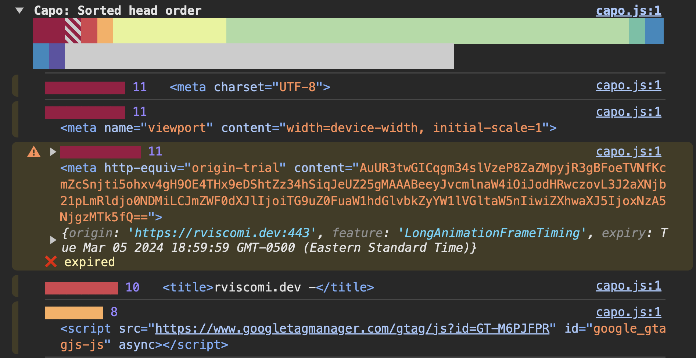
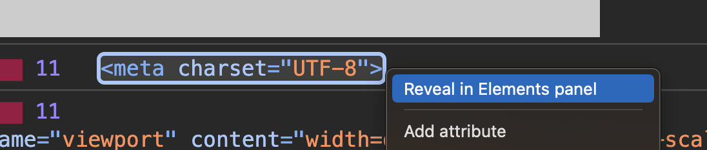
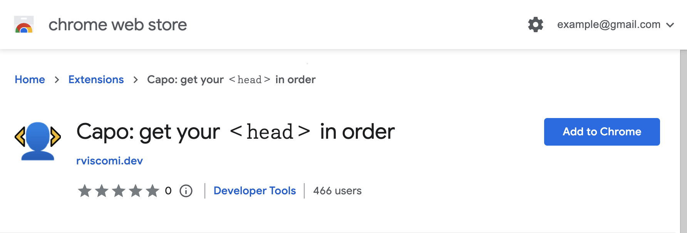

import { Steps } from "@astrojs/starlight/components";
import CapoOptions from "../../../components/CapoOptions.astro";
import CapoPalette from "../../../components/CapoPalette.astro";
import InlineCapoIcon from "../../../components/InlineCapoIcon.astro";
import InlineCapoWeightBars from "../../../components/InlineCapoWeightBars.astro";

Capo is a Chrome extension that gives you one-click access to the capo.js script. Clicking the extension icon ( <InlineCapoIcon/> ) will open a color bar visualizing the `<head>` ordering, and log messages to the console, including validation warnings and detailed element info.

## Understanding the color bar

The first thing you'll see when you click the Capo extension icon ( <InlineCapoIcon/> ) is the color bar. This is how Capo visualizes the _actual_ order of the `<head>` elements as well as the _sorted_ order, with the colors indicating the element weight.

The top row of colors represents the _actual_ order of elements. \
The bottom row of colors represents the _sorted_ order of elements.

Ideally, the actual order will be very similar to the sorted order.

<CapoPalette
  colors='[
  "#9e0142",
  "#d53e4f",
  "#f46d43",
  "#fdae61",
  "#fee08b",
  "#e6f598",
  "#abdda4",
  "#66c2a5",
  "#3288bd",
  "#5e4fa2",
  "#cccccc"
]'
/>

<InlineCapoWeightBars weight="11" length="1" /> _Red_ colors indicate the most important, highest-weighted elements, like [pragma directives](./rules/#-11-pragma-directives) and the [`<title>`](./rules/#-10-title) element.

<InlineCapoWeightBars weight="5" length="1" /> _Green_ colors indicate the average-importance,
medium-weighted elements, like [synchronous scripts](./rules/#-6-synchronous-scripts)
and [styles](./rules/#-5-synchronous-styles).

<InlineCapoWeightBars weight="3" length="1" /> _Blue_ colors indicate low-importance,
low-weighted elements, like [deferred scripts](./rules/#-3-deferred-scripts) and
[speculative resource hints](./rules/#-2-prefetch-and-prerender-hints).

<InlineCapoWeightBars weight="1" length="1" /> _Gray_ indicates the least important,
lowest-weighted elements, as a catch-all for everything else that doesn't have an
explicit weight, like social metadata.

:::tip
Hover over any color in the color bar to display a tooltip summarizing the element and its weight.
:::

See the [Rules](./rules) guide for a complete list of all the weights and what they measure.

## Using Capo in the console

In addition to overlaying the color bar on top of the page, clicking the Capo extension icon ( <InlineCapoIcon/> ) also logs to the DevTools console.

Color bars for the actual and sorted `<head>` orderings are show in addition to a summary of any validation warnings.

Color bars are rendered in a collapsed view by default. Clicking the color bar will expand it into the full details for each element in order. The details include:

- a visualization of the element weight as a colored bar and label
- a reference to the element
- additional validation info (where applicable)

References to elements are interactive. Right-clicking on the element brings up a context menu with a list of actions you can take on the element. Some helpful actions include revealing the element in the Elements panel of DevTools and copying the element markup.

## Installation

To install the Capo extension:

<Steps>

1. Navigate to the [Capo extension](https://chrome.google.com/webstore/detail/capo-get-your-%3Chead%3E-in-o/ohabpnaccigjhkkebjofhpmebofgpbeb) in the Chrome Web Store

   

2. Click the **Add to Chrome** button
3. On any page, click the Capo icon ( <InlineCapoIcon/> ) in the browser toolbar

   Open the DevTools Console to see additional logs

   

</Steps>

:::note
The extension will auto-update whenever new versions are released.
:::

## Configuration

<CapoOptions />

The extension comes with a few default options for static evaluation, validation, and the color palette.

See the [Configuration](/capo.js/user/config/#configuring-the-extension) guide for more info on accessing the options page and what each option does.
